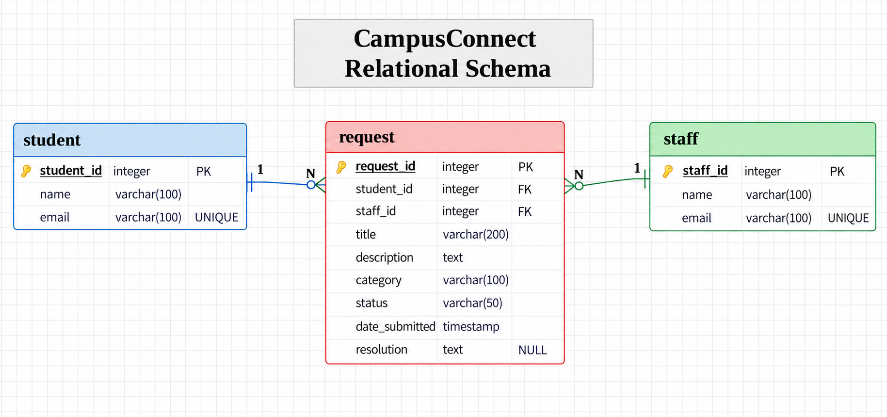

# CampusConnect Database Design

## Purpose

This document defines the initial Cycle 1 database design for CampusConnect.

The design supports the main request workflow where a student submits a request, a staff member reviews it, the request status is updated, and a resolution is recorded.

## ER Diagram

[View CampusConnect ER Diagram](diagrams/campusconnect-er.pdf)

## Relational Schema

## Initial Entities

### Student
- studentID
- studentName
- studentEmail

## Request
- requestID
- studentID
- staffID
- title
- description
- category
- status
- dateSubmitted
- resolution

## Staff
- staffID
- staffName
- staffEmail

## Relationships

- One student can submit many requests.
- Each request belongs to one student.
- One staff member can handle many requests.
- Each request may be assigned to one staff member.

## Initial Assumptions

- Category is stored directly as an attribute of Request for Cycle 1.
- A request may exist before a staff member is assigned.
- A request may not have a resolution until its status is marked as completed.
- Each request has at most one assigned staff reviewer for Cycle 1.
- Synthetic data will be used for students and staff.

